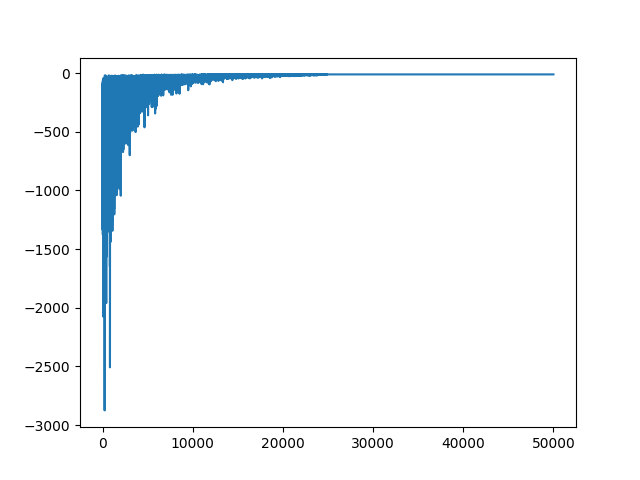

## Creating custom Reinforcement Learning Environments

The code file below is a raw driver code for a custom RL environment similar to a pre-built env.(s) like OpenAI Gym Environments
Creating a Environment class with all the neccessary methods including designing rewards and action policies etc.
The Gridworld problem stated below is solved using a simple Q-Learning epsilon-greedy approach which involves creation of Q-Table and performing DP Update rules via sampling the maximum/greedy actions for a given set of states.

### Q-Learning DP Update rule:


```python
""" Gridworld
    with 2 magic squares that cause the agent to teleport accross the board
    purpose of this is to make the agent learn about the shortcut.
    
    Agent recieves reward of -1 at each step except for the terminal step or
    recieves a reward of 0, therefore agent will attempt to maximize it's 
    reward by minimizing the number of steps it takes to get off the grid world.
     
    State Space -> set of all states excluding the terminal state
    State Space Plus -> set of all states including the terminal state
""" 

import numpy as np
import matplotlib.pyplot as plt

class GridWorld(object):
    def __init__(self, m, n, magicSquares):
        self.grid = np.zeros((m,n))
        self.m = m
        self.n = n
        self.stateSpace = [i for i in range(self.m*self.n)]
        # removing the very last state because that is the terminal state we are excluding.
        self.stateSpace.remove(self.m*self.n - 1)
        self.stateSpacePlus = [i for i in range(self.m*self.n)]
        self.actionSpace = {'U': -self.m, 'D': self.m,
                            'L': -1, 'R': 1}
        self.possibleActions = ['U', 'D', 'L', 'R']
        self.addMagicSquares(magicSquares)
        self.agentPosition = 0
    
    # The agent is represente by a 0 and MG sqaures are represented by 1..
    # need to use any other number to represent magicSq(s) to know where is the entracnce and the exit.
    def addMagicSquares(self, magicSquares):
        self.magicSquares = magicSquares
        i = 2 # representation of the magicSq in the gridWorld
        for square in magicSquares:
            x = square // self.m # floor of the no. of rows and columns.
            y = square % self.n
            self.grid[x][y] = i
            i += 1
            x = magicSquares[square] // self.m
            y = magicSquares[square] % self.n
            self.grid[x][y] = i
            i += 1

    # need to know that we are in the terminal state.
    def isTerminalState(self, state):
        return state in self.stateSpacePlus and state not in self.stateSpace
    
    def getAgentRowAndColumn(self):
        x = self.agentPosition // self.m
        y = self.agentPosition % self.n
        return x,y
         
    # We are assuming that the "new-state" is allowed,
    def setState(self, state):
        x, y = self.getAgentRowAndColumn()
        self.grid[x][y] = 0 # because 0 denotes an MV square
        self.agentPosition = state
        x, y = self.getAgentRowAndColumn()
        self.grid[x][y] = 1

    def OffGridMove(self, newState, oldState):
        if newState not in self.stateSpacePlus:
            return True
        
        elif oldState % self.m == 0 and newState % self.m == self.m - 1:
            return True
        elif oldState % self.m == self.m - 1 and newState % self.m == 0:
            return True
        else:
            return False
    
    def step(self, action):
        x, y = self.getAgentRowAndColumn()
        resultingSate = self.agentPosition + self.actionSpace[action]
        # are we on a magic sq, if we are? then the agent teleports to its new position.
        if resultingSate in self.magicSquares.keys():
            resultingSate = self.magicSquares[resultingSate]
        
        reward = -1 if not self.isTerminalState(resultingSate) else 0
        # So in the OpenAI gym, whenever you take a step, it returns
        # new state, reward, whether not the game is over, some debug information
        # below we are doing almost the similar thing.
        if not self.OffGridMove(resultingSate, self.agentPosition):
            self.setState(resultingSate)
            return resultingSate, reward, \
                self.isTerminalState(self.agentPosition), None
        
        else:
            return self.agentPosition, reward, \
                    self.isTerminalState(self.agentPosition), None
    
    # Reseting the grid after the end of every episode
    def reset(self):
        self.agentPosition = 0
        self.grid = np.zeros((self.m, self.n))
        self.addMagicSquares(self.magicSquares)
        return self.agentPosition

    # One last function
    # Provdide a way to render the things

    def render(self):
        print('---------------')
        for row in self.grid:
            for col in row:
                if col == 0:
                    print('-', end='\t')
                elif col ==1:            # agent there, X denotes the agent
                    print('X', end='\t') 
                elif col ==2:            # one of the entrances to our magicSquares
                    print('Ain', end='\t')
                elif col ==3:            #
                    print('Aout', end='\t')
                elif col ==4:            # other magicSquare entrance
                    print('Bin', end='\t')
                elif col ==5:            # other magicSquare exit
                    print('Bout', end='\t')  
            print('\n')
        print('----------------')

    def actionSpaceSample(self):
        return np.random.choice(self.possibleActions)

def maxAction(Q, state, actions):
    # Wanna take a numpy array of agents estimate the present value of the expected future reward -> V(s)
    values = np.array([Q[state, a] for a in actions])
    action = np.argmax(values)
    return actions[action] # returning the action that corresponds to the index of max of all actions.

if __name__ == '__main__':
    magicSquares = {18: 54, 63: 14} # Teleports
    env = GridWorld(9,9,magicSquares)

    # Model HyperParameters : these controls how fast the agent learns and 
    # how much it choses to value the potential future rewards.
    ALPHA = 0.1
    GAMMA = 1.0 # Discount factor: tells that our agent is going to be totally farsighted counting all future rewards equally
    EPS = 1.0
    """ Q-Learning is a tabular method where you have a 
        table of state-action pairs and you wanna find 
        the value of those state-action pairs, so to
        construct that we have to iterate over the 
        set of state and actions
    """
    Q = {}
    for state in env.stateSpacePlus:
        for action in env.possibleActions:
            Q[state, action] = 0
    # You have to pick something for the initial value
    # It's really arbitrary but the cool thing about picking 0 is that
    # We're using something called Optimistic initial values
    # this means that since the agent takes or recieves a reward of -1 for every step,
    # it can never have a reward of 0 because there is some distance between the agent and the exit
    # Initial value set a 0, we are encouraging exploration of unexplored states because
    # if the agent takes a move, it gets a reward of -1 and realises that it's worse than 0, 
    # let me try this another unexplored option
    # And over time it'll explore enough actions for a given state and pick the best one instead.

    numGames = 50000
    totalRewards = np.zeros(numGames)
    env.render()
    for i in range(numGames):
        if i % 5000 == 0:
            # For every 5k games, Marker to print that we starting i-th numbered Game.
            print('starting game', i)
        # At the top of every episode -> Reset the done flag, rewards, environment as well.
        done = False
        epRewards = 0
        observation = env.reset()

        while not done:
            # Number for our epsilon-greedy action selection
            rand = np.random.random()
            action = maxAction(Q, observation, env.possibleActions) if rand < (1-EPS) \
                else env.actionSpaceSample()
            
            # Defined s'
            observation_, reward, done, info = env.step(action)
            epRewards += reward
            
            # Defined a'
            action_ = maxAction(Q, observation_, env.possibleActions)
            
            # DP Update Rule for Q-Learning:
            Q[observation, action] = Q[observation, action] + ALPHA*(reward + \
                                    GAMMA*Q[observation_, action_] - Q[observation, action])
            
            # Let the agent know, that environment has changed states.
            observation = observation_

        if EPS - 2 / numGames > 0:
            # Linear Decay
            EPS -= 2 / numGames 
        else:
            EPS = 0
        totalRewards[i] = epRewards
    plt.plot(totalRewards)
    plt.show()
    
```



